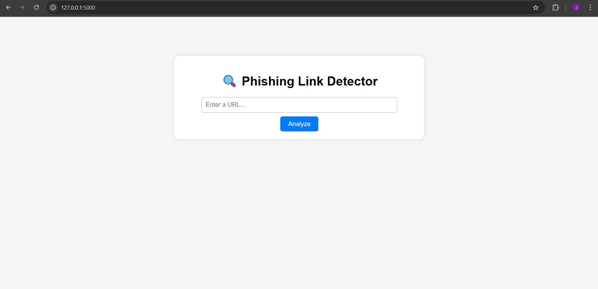
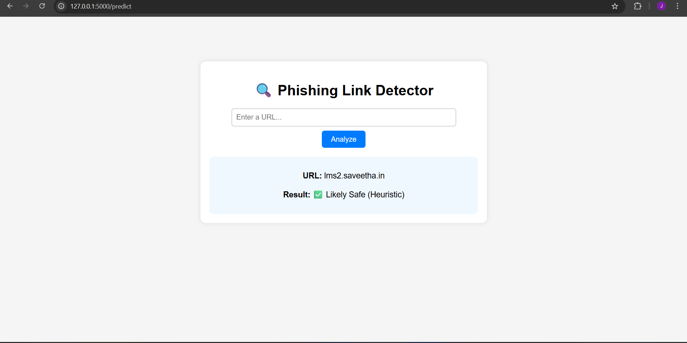
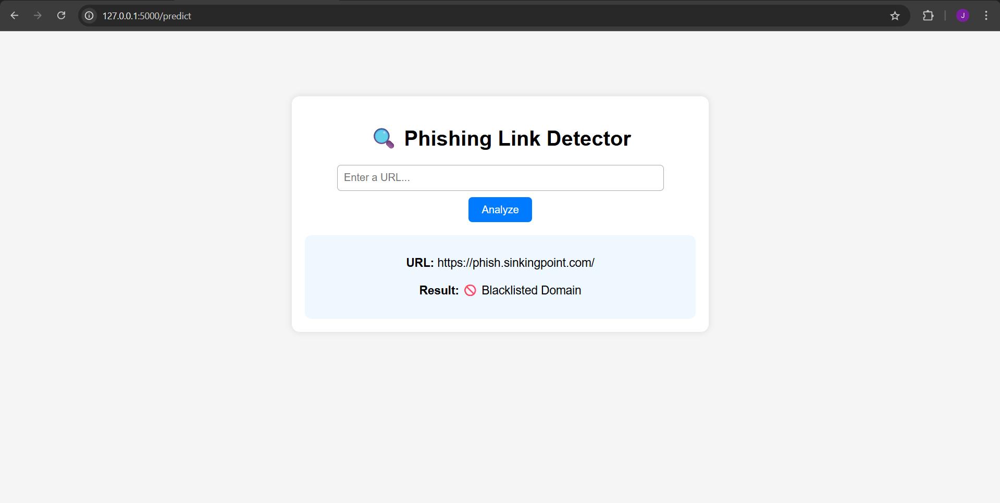

# Phishing URL Analyser
This is a lightweight web app to detect phishing and malicious URLs using a hybrid approach:

     ✅ Google Safe Browsing API (real-time malicious site detection)

     ✅ Rule-based heuristic engine (detects suspicious patterns)

     ✅ Optional: Domain blacklist for manual blocking

## Features
    - Web interface built with Flask
    - Detects malicious or phishing URLs
    - Rule-based scoring system
    - Google Safe Browsing integration
    - Heuristic-based analysis for unknown URLs
    - Optional domain blacklist (e.g. phish.sinkingpoint.com)

## Project Structure

```csharp
phishing-url-analyzer/
│
├── app.py                   # Flask backend
├── templates/
│   └── index.html           # HTML form interface
├── static/
│   └── style.css            # Basic CSS styling
└── README.md                # This file

```

## How it works

1. User enters a URL.
2. App first checks the URL with Google Safe Browsing.
3. If it's not in Google's database, the app uses rule-based scoring to flag suspicious patterns.
4. Output is displayed (Safe, Suspicious, or Dangerous).

## How the Detection Works
    **Feature**	                **Detection Type**
Known malicious URLs	        Google Safe Browsing
Long URLs	                       Rule-based
Use of special characters	       Rule-based
Suspicious keywords	               Rule-based
Multiple subdomains	               Rule-based
Manual domain blacklist	           Custom rule

## Output Screenshot:

### Home page


### Safe and suspicious outputs





## Credits
    Google Safe Browsing API
    Flask Web Framework
    Icons8 for icons (if used)

## Future Improvements

1. Add VirusTotal or PhishTank API
2. Save scan history to database
3. Email link scanner or bulk upload
4. Deploy to Heroku / Render